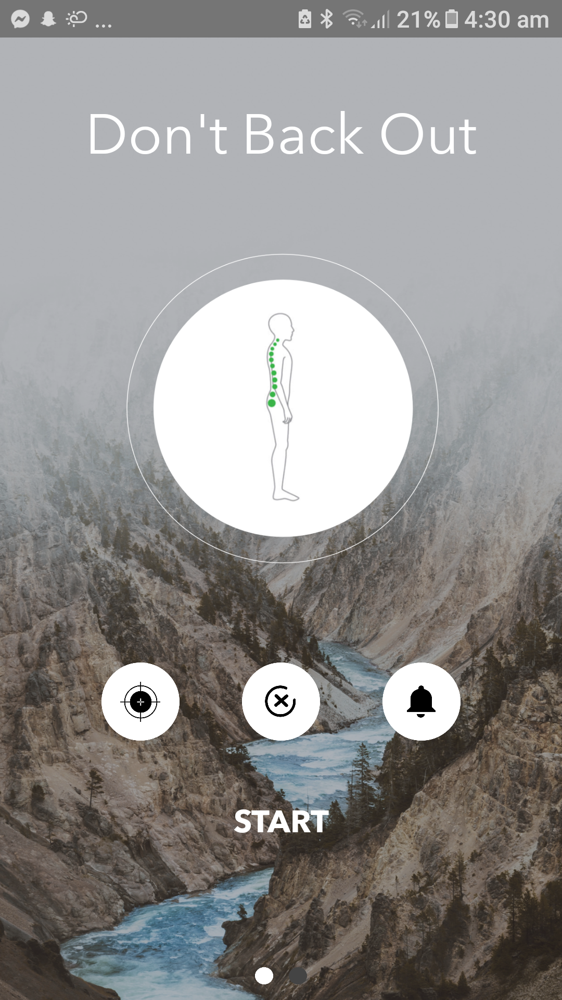
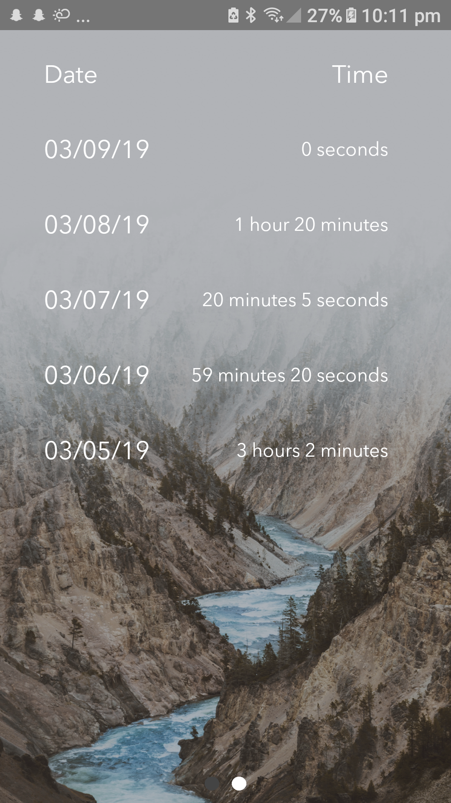

# Don-t Back Out
## by Daniel Truong, William Martino, Nakul Goel
### Mobile Android Application developed by Daniel Truong
This repository is the Android application developed on Android Studio. 

This project was created for **Quarterly Projects (Winter 2019) for iEEE @ UCSD** where we placed **1st** in the showcase out of 20 teams. Quarterly Project @ iEEE UCSD is a program where students can group up into teams, and under a certain theme, develop a project in one quarter that would be showcased to judges who would evaluate projects by polish, impressiveness, and presentation.

## Inspiration
In this modern day and age, bad back posture is a common health issue felt by people of all ages. Most people suffer from this issue because they are just unaware of their bad posture, so we felt that people could improve their posture through a **wearable technology** that uses **statistical machine learning** to inform users when they're slouching.  

## What This Device Does
This mobile application is linked to an Arduino device that would ideally be placed on the back of the user, near the collar ([link to Arduino code](https://github.com/wmartino/Dont-Back-Out-Hardware)). Essentially, the Android application takes in readings of the back angles from accelerometer in the hardware. This data would be sent via bluetooth from the Arduino's **Bluno Beetle**. Using this received data, the application would go through a *calibration mode* where the angles of the user's "straight" and "slouched" posture would stored to calculate the initial user's critical angle. From then on, the user is notified, through the app and the vibration motor on the hardware, whenever they are slouching for too long. 

## Other Features
1) Toggling Notfications: User is able to turn on/off notifications if they no longer wants to receive notifications for their back.
2) Recalibration: If the applicaton is unable to read the user's posture correctly, the user is able to click the left recalibration button to reset the initial data entries and receive new data.
3) Time Stored: The application can also store how long the user stays in good posture per day.

To learn more about this project, check out our [website](https://dontbackout.com). If you have any questions regarding this project, you can contact me through my email **ddtruong06@gmail.com**. 
